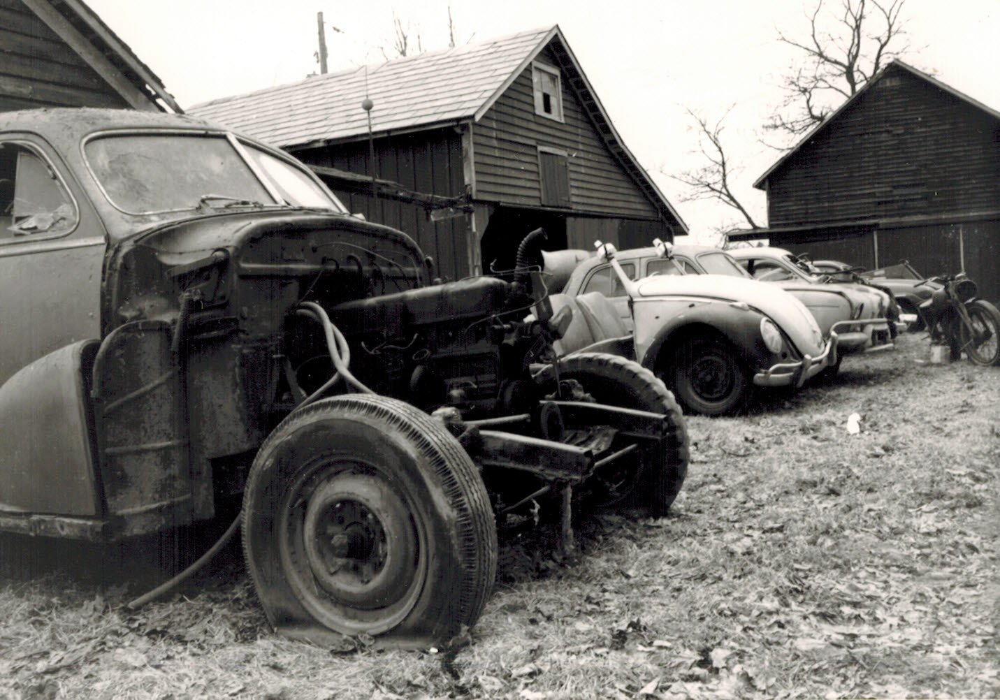
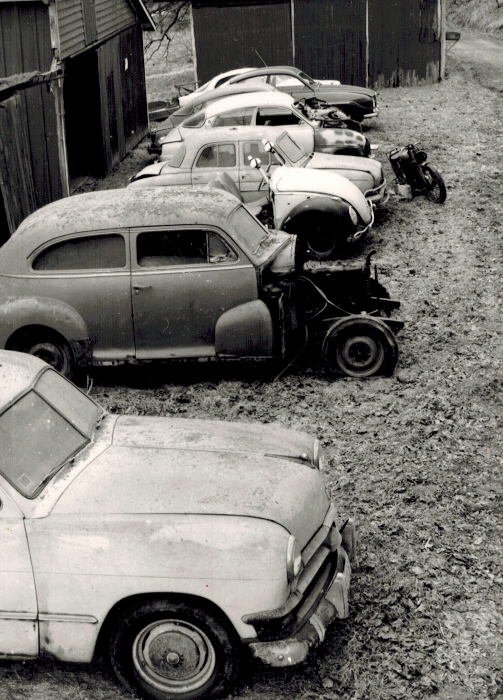
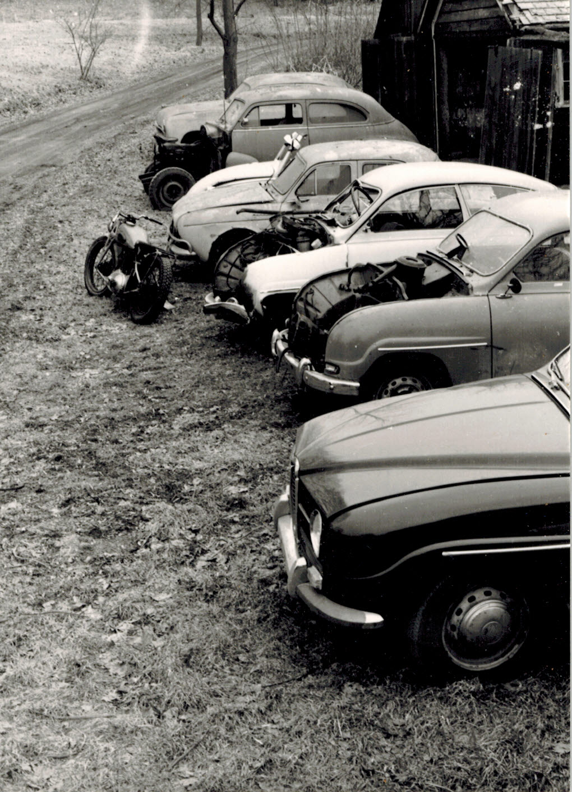
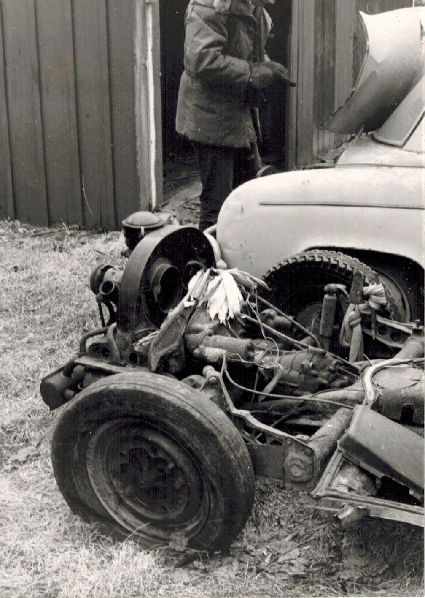
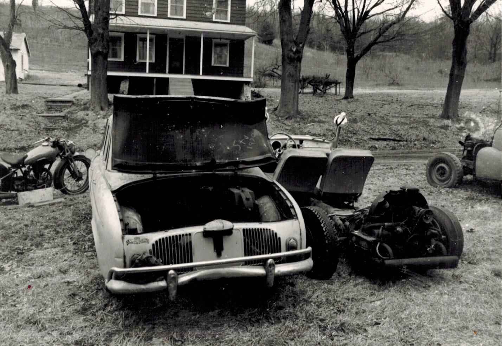
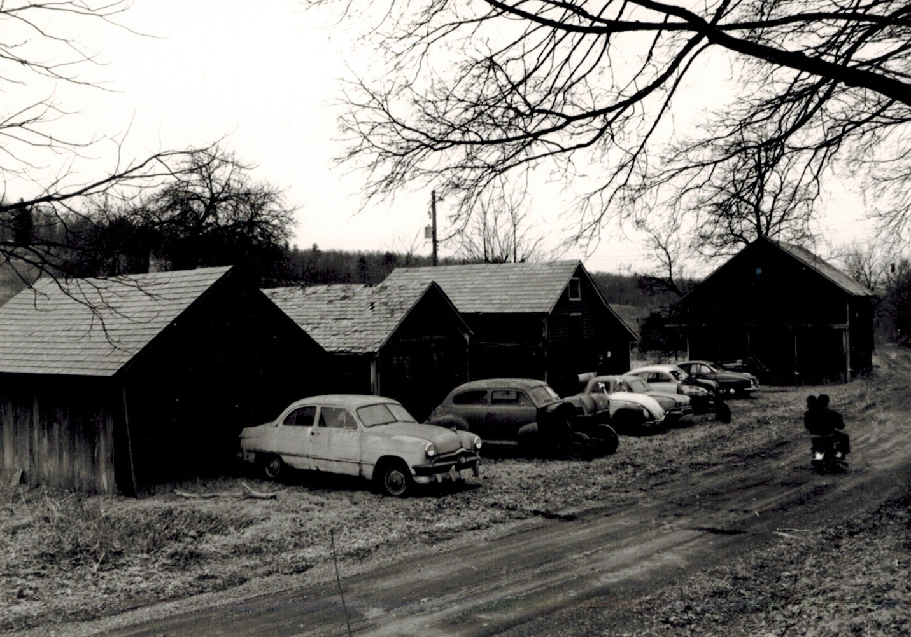
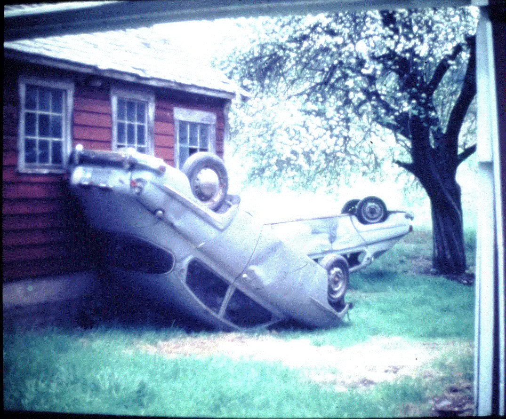

# car-day
Car day at the farm, Little Gap, PA, in March, 1972

One day we decided to drag all the cars and stuff out of their respective barns and get a good look at them all. We were trying to get rid of some of the worst clunkers to make in-barn space for parking or repairs.

## The cars (and stuff)

Left-to-right:

* 1950 Ford Fordor(?)
* 1948 Chevrolet
* 1961 VW Beetle
* 1958 Renault Dauphine
* 19xx NSA(?) Motorcycle
* 1960 Saab 96 (wreck)
* 1960 Saab 96 (parts)
* 1965 Saab 96
* 196x Alfa Romeo Giulietta Sprint 1300
* 196x Ford 2000 tractor

Not pictured with group

* 1940x Oliver Cletrac HG Crawler tractor
* 1948 Plymouth sedan (rope tow ski lift powerplant)
* Some other Saab 96s

## The photos

### The lineup

### 1950 Ford, 1948 Chevy

### 1948 Chevy front end detail

### Aerial views

### 1961 VW Beetle

### 1958 Renault Dauphine, 1961 VW Beetle

### NSA Motorcycle

 Motorcycle")

### 1948 Plymouth as a ski tow powerplant

### Bonus time - unannounced minibike!

While photographing the cars these two teens blew through on a minibike. Ahhh, life in rural eastern Pennsylvania!

## About the cars

### 1950 Ford Fordor(?)

* My dad bought it new
* Second gear eventually got damaged and it sounded really bad. We fixed it by grinding the teeth off of the failed gear so that the car was a two-speed with only first and third gears moving the car.

### 1948 Chevrolet

* Bought it for $5 from the folks over the hill
* It never ran beyond coasting downhill
* Had an AM radio with vacuum tubes

### 1961 VW Beetle

* Profound rust took the car off the road
* Converted to field buggy by cutting at top of windshield and heaving the rust-detached body aside
* While cutting the driver's side A-pillar the hacksaw got unreasonably hot. Oh yeah, I'm cutting through the battery cable!
* It was a riot to drive this up and down the hills, especially if you like goldenrod and bees in the face.
* Hacked-off A-pillars were really dangerous. Styrofoam covers fixed that.

### 1958 Renault Dauphine

* Nice buy for US$1 in 1965 from a family friend
* A real oil burner
* Got it up to 45 mph once

### 19xx NSU(?) Motorcycle

* A little much for our dorm room but we had it anyway

### 1960 Saab 96 (wreck)

* Oops! Everyone got hurt but we all survived
* It had the stick with Bakelite handle through the firewall to the drivers knee. For tapping the fuel pump to get it going.
* Had a sheet metal bottom front-to-rear and could get stuck in deeper snow by sled action. All four wheels six inches off the ground.

### 1960 Saab 96 (parts)

* Never ran. The price was $50 as long as I took the other one, a real junker; if not then $100.

### 1965 Saab 96

* Registered, tires, brakes, and everything including an inspection sticker

### 196x Alfa Romeo Giulietta Sprint 1300

* Some college buddy stashed it
* It had storm damage where snow from a barn roof fell and crushed the hood and front end. Ugh.

### 196x  Ford 2000 tractor

* Belonged to a neighbor
* Allegedly used to be mowing equipment on the New Jersey Turnpike

### 1940x Oliver Cletrac HG Crawler tractor

* Bought from the previous property owners in 1963
* It used to throw tracks off the bogey wheels at inopportune times
* Herculese marine engine with updraft carburetor was a bitch to start
* Starting with hand crank was dangerous
* Often jumped the 6v system with 12v to get it going
* It used to blow red-hot chunks of carbon out the exhaust. They landed on the operator to burn skin, holes in clothes, etc.

### 1948 Plymouth sedan (rope tow ski lift powerplant)

* Set on blocks
* Bolt the driver's side rear brake drum to the brake shoes
* Drive a 1-inch manila rope for the ski tow off the passenger side
* Square nail holds throttle at adjustable setting for lift speed
* Totally safe! What could possiby go wrong?

### Some other Saab 96s

A photo from a different day. Locals like to play games and did pranks like this. When you visited the farm you never knew for sure what you'd find. Once I found more Saabs there than I had when last I left. Imagine that.
